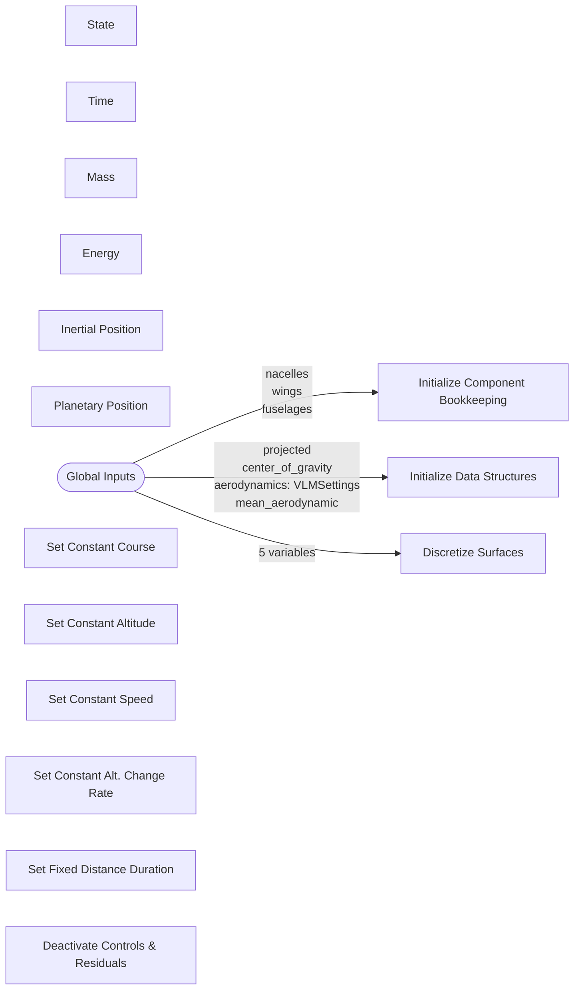

```mermaid
graph LR
    N0[State]
    N1[Time]
    N2[Mass]
    N3[Energy]
    N4[Inertial Position]
    N5[Planetary Position]
    N6[Initialize Component Bookkeeping]
    N7([Global Inputs])
    N8[Initialize Data Structures]
    N9[Discretize Surfaces]
    N10[Set Constant Course]
    N11[Set Constant Altitude]
    N12[Set Constant Speed]
    N13[Set Constant Alt. Change Rate]
    N14[Set Fixed Distance Duration]
    N15[Deactivate Controls & Residuals]    
    N7 -->|nacelles<br>wings<br>fuselages| N6
    N7 -->|projected<br>center_of_gravity<br>aerodynamics: VLMSettings<br>mean_aerodynamic| N8
    N7 -->|5 variables| N9
```
