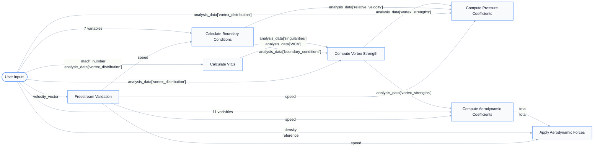

```mermaid
%%{init: {'theme': 'base', 'themeVariables': { 
        'primaryColor': '#f8fafc', 
        'primaryBorderColor': '#3b82f6', 
        'primaryTextColor': '#0f172a', 
        'lineColor': '#94a3b8', 
        'fontFamily': 'Inter, system-ui, sans-serif'
    }}}%%
graph LR
    N0[Freestream Validation]
    N1([User Inputs])
    N2[Calculate Boundary Conditions]
    N3[Calculate VICs]
    N4[Compute Vortex Strength]
    N5[Compute Pressure Coefficients]
    N6[Compute Aerodynamic Coefficients]
    N7[Apply Aerodynamic Forces]
    N0 -->|"speed"| N2
    N0 -->|"speed"| N5
    N0 -->|"speed"| N6
    N0 -->|"speed"| N7
    N1 -->|"velocity_vector"| N0
    N1 -->|"7 variables"| N2
    N1 -->|"mach_number<br>analysis_data['vortex_distribution']"| N3
    N1 -->|"analysis_data['vortex_distribution']"| N4
    N1 -->|"analysis_data['vortex_distribution']"| N5
    N1 -->|"11 variables"| N6
    N1 -->|"density<br>reference"| N7
    N2 -->|"analysis_data['boundary_conditions']"| N4
    N2 -->|"analysis_data['relative_velocity']"| N5
    N3 -->|"analysis_data['singularities']<br>analysis_data['VICs']"| N4
    N4 -->|"analysis_data['vortex_strengths']"| N5
    N4 -->|"analysis_data['vortex_strengths']"| N6
    N6 -->|"total<br>total"| N7
```
