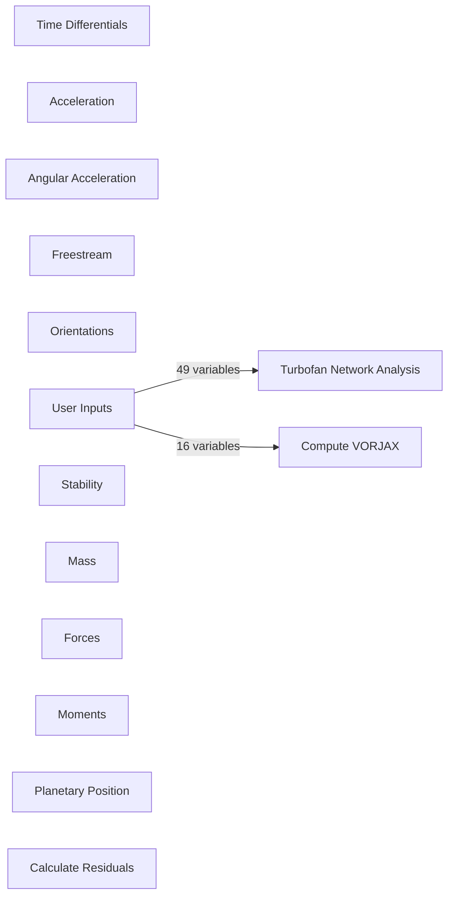

```mermaid
graph LR
    N0[Time Differentials]
    N1[Acceleration]
    N2[Angular Acceleration]
    N3[Freestream]
    N4[Orientations]
    N5[Turbofan Network Analysis]
    N6[User Inputs]
    N7[Compute VORJAX]
    N8[Stability]
    N9[Mass]
    N10[Forces]
    N11[Moments]
    N12[Planetary Position]
    N13[Calculate Residuals]
    N6 -->|49 variables| N5
    N6 -->|16 variables| N7
```
