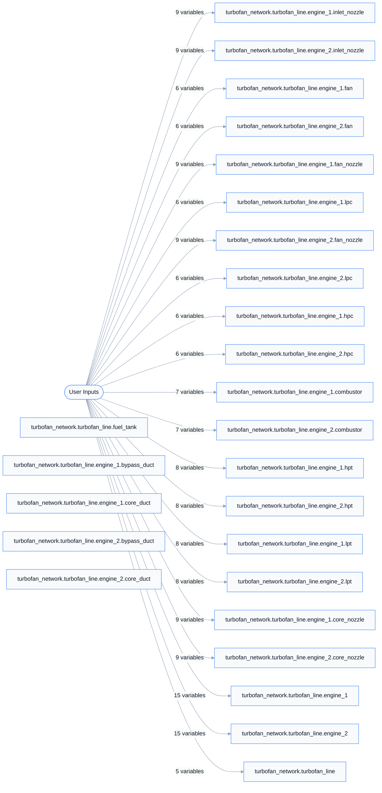

```mermaid
%%{init: {'theme': 'base', 'themeVariables': { 
        'primaryColor': '#f8fafc', 
        'primaryBorderColor': '#3b82f6', 
        'primaryTextColor': '#0f172a', 
        'lineColor': '#94a3b8', 
        'fontFamily': 'Inter, system-ui, sans-serif'
    }}}%%
graph LR
    N0[turbofan_network.turbofan_line.engine_1.inlet_nozzle]
    N1([User Inputs])
    N2[turbofan_network.turbofan_line.engine_2.inlet_nozzle]
    N3[turbofan_network.turbofan_line.fuel_tank]
    N4[turbofan_network.turbofan_line.engine_1.fan]
    N5[turbofan_network.turbofan_line.engine_2.fan]
    N6[turbofan_network.turbofan_line.engine_1.bypass_duct]
    N7[turbofan_network.turbofan_line.engine_1.core_duct]
    N8[turbofan_network.turbofan_line.engine_2.bypass_duct]
    N9[turbofan_network.turbofan_line.engine_2.core_duct]
    N10[turbofan_network.turbofan_line.engine_1.fan_nozzle]
    N11[turbofan_network.turbofan_line.engine_1.lpc]
    N12[turbofan_network.turbofan_line.engine_2.fan_nozzle]
    N13[turbofan_network.turbofan_line.engine_2.lpc]
    N14[turbofan_network.turbofan_line.engine_1.hpc]
    N15[turbofan_network.turbofan_line.engine_2.hpc]
    N16[turbofan_network.turbofan_line.engine_1.combustor]
    N17[turbofan_network.turbofan_line.engine_2.combustor]
    N18[turbofan_network.turbofan_line.engine_1.hpt]
    N19[turbofan_network.turbofan_line.engine_2.hpt]
    N20[turbofan_network.turbofan_line.engine_1.lpt]
    N21[turbofan_network.turbofan_line.engine_2.lpt]
    N22[turbofan_network.turbofan_line.engine_1.core_nozzle]
    N23[turbofan_network.turbofan_line.engine_2.core_nozzle]
    N24[turbofan_network.turbofan_line.engine_1]
    N25[turbofan_network.turbofan_line.engine_2]
    N26[turbofan_network.turbofan_line]
    N1 -->|"9 variables"| N0
    N1 -->|"9 variables"| N2
    N1 -->|"6 variables"| N4
    N1 -->|"6 variables"| N5
    N1 -->|"9 variables"| N10
    N1 -->|"6 variables"| N11
    N1 -->|"9 variables"| N12
    N1 -->|"6 variables"| N13
    N1 -->|"6 variables"| N14
    N1 -->|"6 variables"| N15
    N1 -->|"7 variables"| N16
    N1 -->|"7 variables"| N17
    N1 -->|"8 variables"| N18
    N1 -->|"8 variables"| N19
    N1 -->|"8 variables"| N20
    N1 -->|"8 variables"| N21
    N1 -->|"9 variables"| N22
    N1 -->|"9 variables"| N23
    N1 -->|"15 variables"| N24
    N1 -->|"15 variables"| N25
    N1 -->|"5 variables"| N26
```
